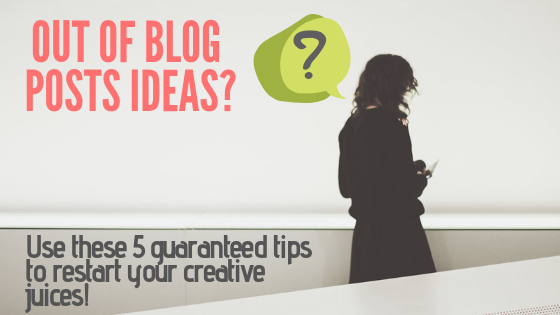
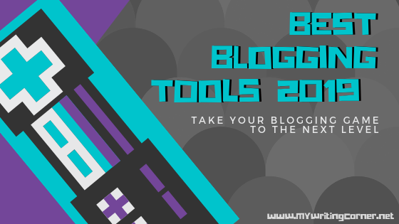
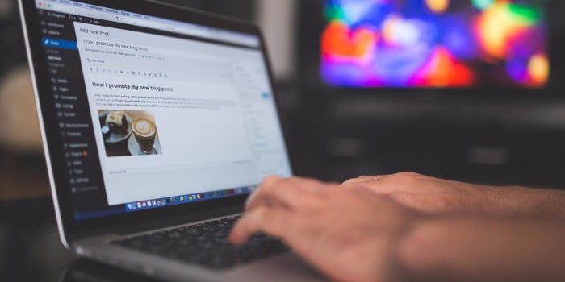

 
## No idea what to write about? Try these 6 tips guaranteed to help you generate ideas for your blog posts
### 06/10/2019

You got your blog, you set everything up, hosting, domain name, you actually took three days to define the perfect theme and now everything looks just right. _What now?_
You're supposed to be writing content now, but what? That's the main question, and here you'll find some tips & tricks I (and others) use to make the jump from _wanting_ to write about something into _knowing_ what to write about.

[Read more](./2019/06/10/getting-blogpost-ideas.html) 

 
## It's time to take your game to the next level with these 12 blogging tools
### 06/07/2019

Find the best blogging tools for 2019 and what you can do with them to improve your blogging-foo and take it into the next level.

[Read more](./2019/06/07/best-blogging-tools.html) 

 
## Should I start a blog?
### 06/04/2019

That question is always nagging the back of our mind, should I start my own blog? Is blogging the right platform to reach my intended audience? 
Should I instead go to YouTube? Keep reading and I'll try to help you decide.

[Read more](./2019/06/05/should-i-start-a-blog.html) 

